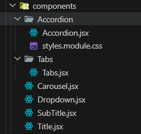
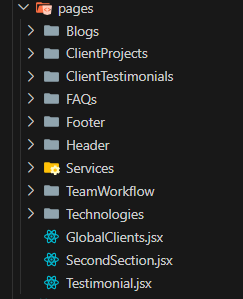
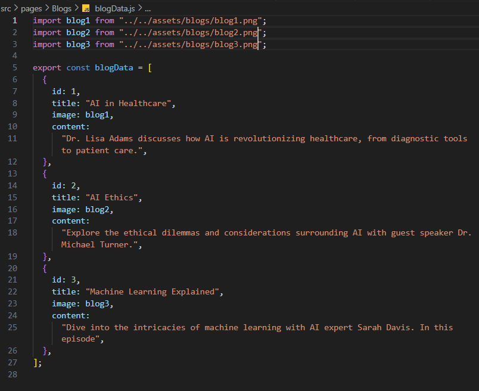
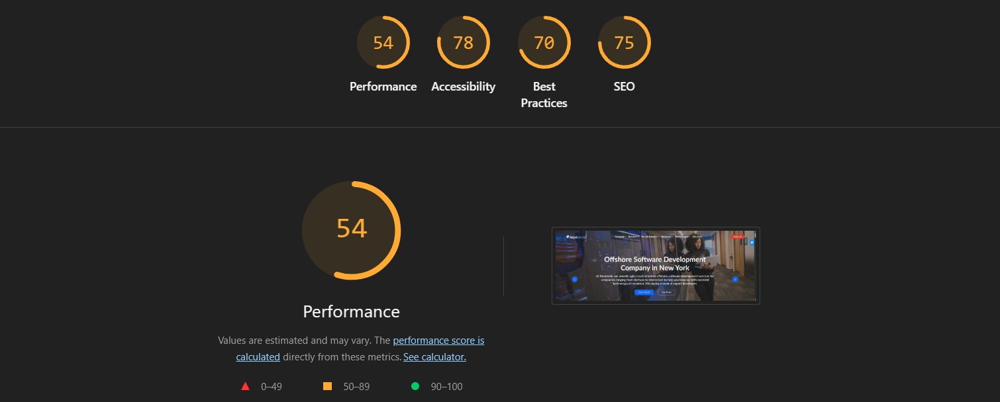

# Install dependencies & run

* clone repo
* npm install
* npm run dev
* live-demo: [live](https://nextwebi-liart.vercel.app/)

# Technologies used

* React.js, JavaScript, Styled Component, HTML&CSS

# Dev Principles & Best Practices

## Modularity & Reusability

I have ensured that the frequently used and reusable components must be kept handy.

* Carousel
* Tabs
* Accordion
* Frequenly used Headers and Titles

## Maintainability & Organizations

I have provided a well structured and easy to track folder structure with self-descriptive namings corresponding to the sections in the page.

## Scalability

I have implemented config driven components ensuring the future scalings of data with proper key-value pairs.

## Accessibilty & SEO

Keeping the screen-readers in mind I have mentioned enough ARIA attributes, semantic tags and roles to the required elements.

## Responsive UI

Have applied mobile-first approach to give fully responsive design to the page.

## Performance

### I could have also implemented lazy loading and code-splitting for tab components in order to improve the performance.

# React + Vite

This template provides a minimal setup to get React working in Vite with HMR and some ESLint rules.

Currently, two official plugins are available:

- [@vitejs/plugin-react](https://github.com/vitejs/vite-plugin-react/blob/main/packages/plugin-react) uses [Babel](https://babeljs.io/) for Fast Refresh
- [@vitejs/plugin-react-swc](https://github.com/vitejs/vite-plugin-react/blob/main/packages/plugin-react-swc) uses [SWC](https://swc.rs/) for Fast Refresh

## Expanding the ESLint configuration

If you are developing a production application, we recommend using TypeScript with type-aware lint rules enabled. Check out the [TS template](https://github.com/vitejs/vite/tree/main/packages/create-vite/template-react-ts) for information on how to integrate TypeScript and [`typescript-eslint`](https://typescript-eslint.io) in your project.
